# ALB + ECS Fargate – Cross-account architecture

`app` stack → **Production account (PROD)**  
`cicd` stack → **Management account (CICD)**

Deploy order: `fargate-app` first, then `fargate-cicd`.

Arrow legend:
- `──►` data / invocation flow
- `·····►` policy relationship (encryption, resource policy)
- `═══►` cross-account STS role assumption

```mermaid
graph LR
    subgraph cicd ["☁️  Management Account · CICD  (fargate-cicd stack)"]
        gh(("GitHub"))
        conn["CodeStar Connection"]

        subgraph cpipe ["CodePipeline · fargate"]
            stg1["① Source"]
            stg2["② Build"]
            stg3["③ Deploy"]
            stg1 --> stg2 --> stg3
        end

        cbBuild["CodeBuild · BuildApp\n────────────────────────\nmvn package\ndocker build & tag\ndocker push → ECR\nemit imagedefinitions.json"]

        cbDeploy["CodeBuild · DeployToFargate\n────────────────────────\nread imagedefinitions.json\nsts:AssumeRole →\ndescribe-services  ← task def ARN\ndescribe-task-definition\nregister-task-definition  new image\nupdate-service\nwait services-stable"]

        ecr["ECR Repository\n(cross-account resource policy:\nallows PROD to pull)"]

        bucket["S3 Artifact Bucket\n(cross-account bucket policy:\nallows PROD to read)"]

        kmsKey["KMS Key\n(cross-account key policy:\nallows PROD to decrypt)"]

        cbRole["CodeBuild Role\nfargate-codebuild-service-role\n────────────────────────\nlogs · ecr · codebuild\nkms · s3 · sts:AssumeRole"]

        cpRole["CodePipeline Role\nfargate-codepipeline-role\n────────────────────────\ncodebuild · codestar-connections\nkms · s3 · iam:PassRole"]

        gh -->|"push"| conn --> stg1
        stg2 -.->|runs| cbBuild
        stg3 -.->|runs| cbDeploy
        cbBuild -->|"docker push"| ecr
        cbBuild -->|"imagedefinitions.json"| bucket
        bucket -.-|"encrypted by"| kmsKey
        cbBuild -.-|"uses"| cbRole
        cbDeploy -.-|"uses"| cbRole
        cpipe -.-|"uses"| cpRole
    end

    subgraph prod ["☁️  Production Account · PROD  (fargate-app stack)"]
        crossRole["IAM Role\nfargate-cross-account-deploy-role\n────────────────────────\nTrusted by: CICD account\necs:DescribeServices\necs:DescribeTaskDefinition\necs:RegisterTaskDefinition\necs:UpdateService\niam:PassRole  s3:Get*  kms:Decrypt"]

        subgraph vpcBox ["VPC · 2 AZs · public + private subnets"]
            alb["ALB  :80\n(internet-facing)"]

            subgraph privateSub ["Private Subnets"]
                ecsSvc["ECS Fargate Service\n────────────────────────\ncluster: PROJECT_DEPLOYMENT_NAME\ndesired: 2  max: 10\ncapacity: FARGATE + FARGATE_SPOT\ncontainer port :8080"]
            end
        end

        execRole["Task Execution Role\nfargate-task-execution-role\n(AmazonECSTaskExecutionRolePolicy)"]

        taskRole["Task Role\nfargate-task-role\n────────────────────────\necs:Describe/ListTasks\ns3:*  ssm:GetParameter\necs:ListServices"]

        ssmParam["SSM Parameter\n/custom/stress"]

        alb -->|":8080  /actuator/health"| ecsSvc
        execRole -->|"attached to task"| ecsSvc
        taskRole -->|"attached to task"| ecsSvc
        ecsSvc -.->|"reads"| ssmParam
    end

    cbDeploy ===>|"① sts:AssumeRole"| crossRole
    crossRole -->|"② ECS API calls\n   (describe → register → update)"| ecsSvc
    ecr -.->|"③ pull image\n   (ECR resource policy\n    allows PROD account)"| execRole
    kmsKey -.->|"kms:Decrypt\n(key policy)"| crossRole
    bucket -.->|"s3:GetObject\n(bucket policy)"| crossRole
```

## Deployment flow

1. **Source** – CodeStar Connection polls GitHub; on push to `main` the pipeline triggers and fetches the source archive into the S3 artifact bucket (KMS-encrypted).

2. **Build** – `CodeBuildApp` (CICD account) runs `mvn package`, builds the Docker image and pushes it to ECR with two tags (`latest` and `$CODEBUILD_RESOLVED_SOURCE_VERSION`). It then writes `imagedefinitions.json` as the stage output artifact.

3. **Deploy** – `CodeBuildDeploy` (CICD account):
   - Reads `imagedefinitions.json` from the input artifact to get the new image URI.
   - Calls `sts:AssumeRole` to obtain temporary credentials for `fargate-cross-account-deploy-role` in the PROD account.
   - Under those credentials: resolves the current task definition ARN via `ecs:DescribeServices`, fetches the task definition JSON, swaps the container image URI (and drops the nginx bootstrap `command` override), registers the new revision, and calls `ecs:UpdateService`.
   - Waits for the service to stabilise (`aws ecs wait services-stable`).

## Cross-account trust details

| Resource (CICD) | Policy type | What it grants to PROD |
|---|---|---|
| KMS Key | Key resource policy | `kms:Decrypt`, `kms:DescribeKey` |
| S3 Artifact Bucket | Bucket resource policy | `s3:Get*`, `s3:List*` |
| ECR Repository | Repository resource policy | `ecr:GetDownloadUrlForLayer`, `ecr:BatchGetImage`, `ecr:BatchCheckLayerAvailability` |

| Resource (PROD) | Trust policy | What it grants to CICD |
|---|---|---|
| `fargate-cross-account-deploy-role` | Trusts entire CICD account | ECS describe/register/update, `iam:PassRole`, S3 read, KMS decrypt |
