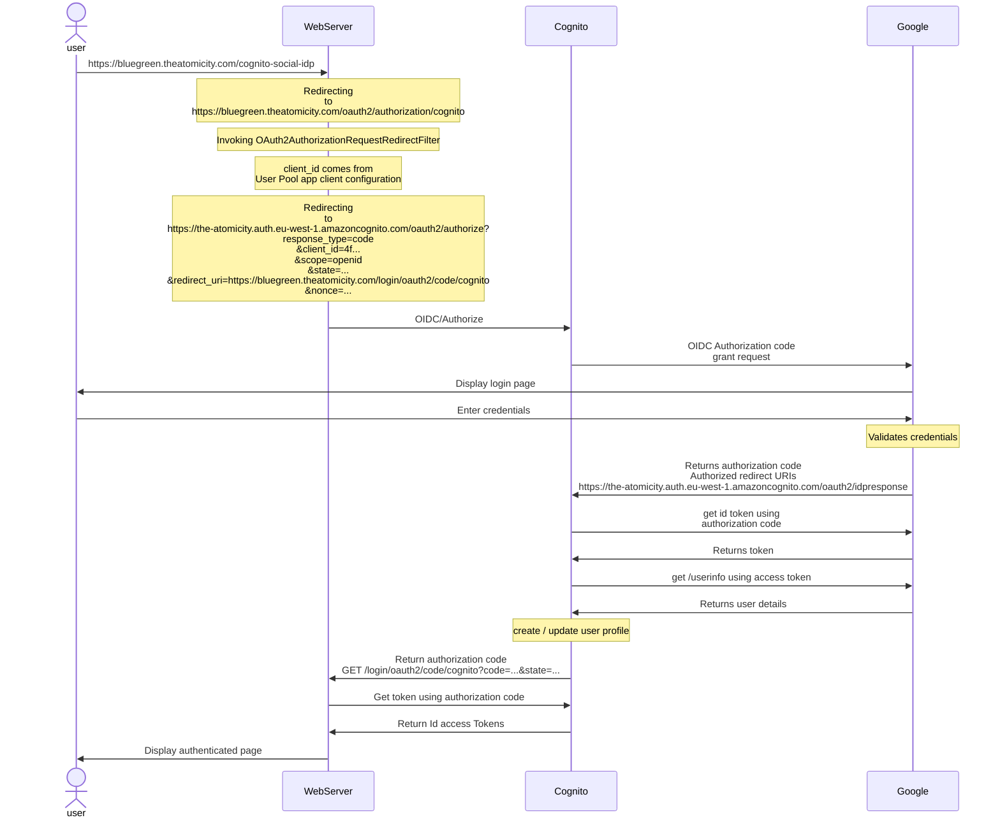

# Web idp

## Google Developer Console

- Project
  Name: [GoogleProjectSignOn](https://console.cloud.google.com/welcome?orgonly=true&project=healthy-dragon-353109&supportedpurview=organizationId)
    - APIs & Services
        - Credentials
        - OAuth consent screen
            - Publishing status
                - Testing -> In Production [SET]

## Principle

Athenticated Spring boot with OAuth2 based on Google Social Sign In

### Pre-requisites

- A secured listener on 443 with valid TLS certificate (ACM)
- Spring Security configuration for Oauth2
- A public alias on route53 for callBack
- Some Api Credentials (ClientId:ClientSecret) created
  on [Google Developer Console](https://console.cloud.google.com/apis/credentials/oauthclient/70957737117-ialsbh05oq0u1abo0oemb064qsqibpmp.apps.googleusercontent.com?project=healthy-dragon-353109)

## Flow diagram

- Medium
    - [How to integrate AWS Cognito with Google Social login?](https://awskarthik82.medium.com/how-to-integrate-aws-cognito-with-google-social-login-fd379ff644cc)
- Youtube
    - [How to integrate AWS Cognito with Google Social login?](https://www.youtube.com/watch?v=7r0eBNBNEZ8)

- Sequence Diagram (Draft)

### Oauth Grant Types

- **Implicit** was a legacy grant type, previously recommended for clients without a secret.
    - It is not recommended to use the implicit flow due to the inherent risks of returning access tokens directly in an
      HTTP redirect without any confirmation that it has been received by the intended client. It has been superseded by
      using the Authorization Code grant type for mobile or web applications.
    - Implicit grant is deprecated and no longer recommended
- **Client credentials** for application access without a user present, mostly between a web server to another server
  application.
- **Authorization Code** for apps running on a web server, browser-based and mobile apps.

### Definition

https://docs.aws.amazon.com/cognito/latest/developerguide/what-is-amazon-cognito.html

#### AWS Cognito User Pool

User pools are **user directories** that provide sign-up and sign-in options for your app users.

-> Authentication

##### Features

- Sign-up and sign-in services.
- A built-in, customizable web UI to sign in users.
- Social sign-in with Facebook, Google, Login with Amazon, and Sign in with Apple, and through SAML and OIDC identity
  providers from your user pool.
- User directory management and user profiles.
- Security features such as multi-factor authentication (MFA), checks for compromised credentials, account takeover
  protection, and phone and email verification.
- Customized workflows and user migration through AWS Lambda triggers.

#### AWS Cognito Identity Pool

Identity pools enable you to grant your users access to other AWS services

-> Authorization

With an identity pool, your users can obtain temporary AWS credentials to access AWS services, such as Amazon S3 and
DynamoDB. Identity pools support anonymous guest users, as well as the following identity providers that you can use to
authenticate users for identity pools:
Amazon Cognito user pools

- Social sign-in with Facebook, Google, Login with Amazon, and Sign in with Apple
- OpenID Connect (OIDC) providers
- SAML identity providers
- Developer authenticated identities

### Testing

- AWS Cognito
    - User Pools
        - CognitoUserPool-XXXXX
            - App integration
                - AppClient: CognitoUserPoolAppClient-XXXXX
                    - View HostedUI
                        - Connect with Google

A JWT token is displayed in callback URL

https://www.example.com/cb#access_token=eyXXXXXXXXX&token_type=Bearer&expires_in=3600

### Reference

https://rieckpil.de/thymeleaf-oauth2-login-with-spring-security-and-aws-cognito/

- Tomcat native library

https://blog.csdn.net/weixin_41561929/article/details/109344332

- implicit grant type

https://dev.to/jinlianwang/setting-up-implicit-grant-workflow-in-aws-cognito-step-by-step-5feg

- authorization code grant type

https://dev.to/jinlianwang/user-authentication-through-authorization-code-grant-type-using-aws-cognito-1f93

- enable X-Forwarded-Proto processing in spring boot

https://stackoverflow.com/questions/68318269/spring-server-forward-headers-strategy-native-vs-framework