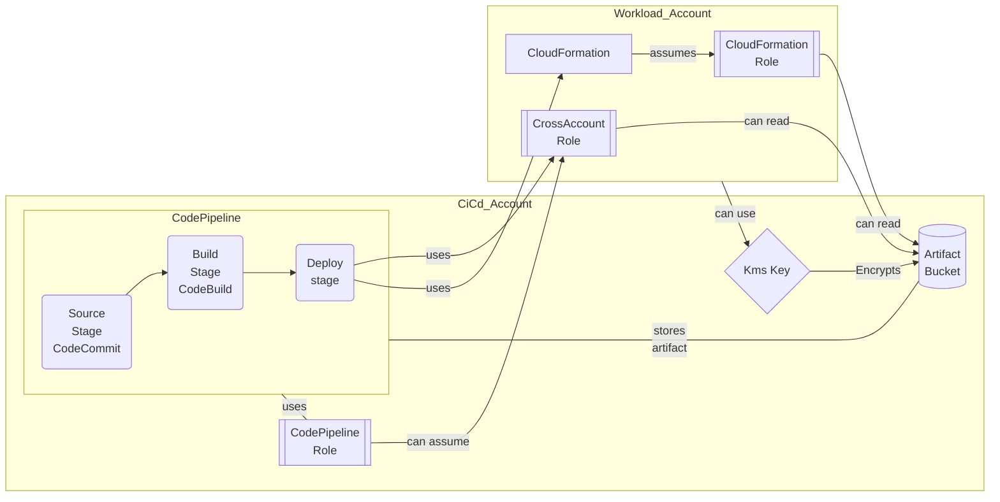

# Multi-account pipeline

```mermaid
    graph LR
    subgraph CiCd_Account
        subgraph CodePipeline
            CodeCommit(Source\nStage\nCodeCommit)
            CodeCommit --> CodeBuild(Build\nStage\nCodeBuild)
            CodeBuild --> Deploy(Deploy\nstage)
        end
        CodePipeline ---|stores\nartifact| artifact_bucket[(Artifact\nBucket)]
        CodePipeline ---|uses| codepipeline_role[[CodePipeline\nRole]]
        KmsKey{Kms Key} -->|Encrypts| artifact_bucket
    end
    subgraph Workload_Account
        Deploy -->|uses| cross_account_role[[CrossAccount\nRole]]
        Deploy -->|uses| CloudFormation
        CloudFormation -->|assumes| cloudformation_role[[CloudFormation\nRole]]
    end
    Workload_Account -->|can use| KmsKey
    cloudformation_role -->|can read| artifact_bucket
    cross_account_role -->|can read| artifact_bucket
    codepipeline_role -->|can assume| cross_account_role 
```